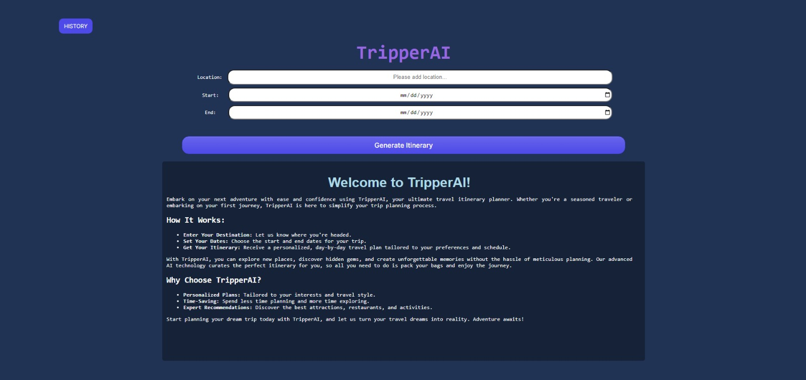
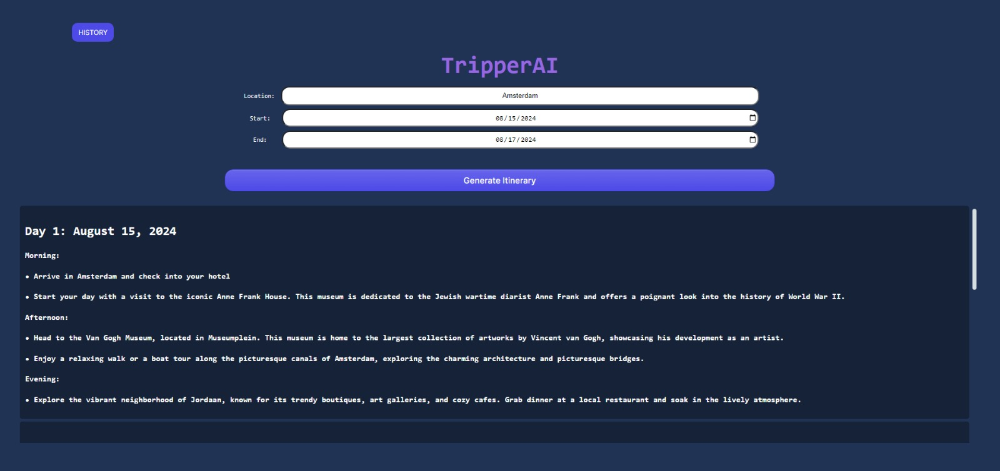
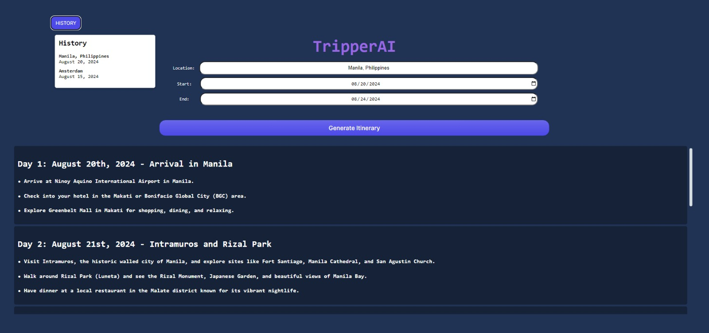

# TripperAI

TripperAI is a ReactJS web application that helps you generate travel itineraries based on the location and dates you provide. It uses OpenAI's GPT-3.5-turbo model to generate a detailed itinerary and displays it in a user-friendly interface. You can also view the history of your generated itineraries.

## Features

- **Location and Date Input**: Users can input their travel location and dates to generate an itinerary.
- **Dynamic Itinerary Generation**: Uses OpenAI's GPT-3.5-turbo API to create detailed travel itineraries.
- **History**: Stores previously generated itineraries and allows users to view them.
- **User-Friendly Interface**: Provides a clean and intuitive UI for easy interaction.

## Screenshots





## Running Program

### Install the dependecies
In your terminal, type:

```
npm install
npm install react-scripts
npm install axios
```

### Input OpenAI key into App.js

Replace the code on the [App.js line 31](https://github.com/miguel-sadorra/TripperAI/blob/main/src/App.js#L31) from
```
INPUT_OPENAI_API_KEY
```

to your OpenAI API key

### Run the program in your terminal
In you terminal, type the following line to run the code:
```
npm start
```

## Usage
### Enter Travel Details 
Fill in the location, start date, and end date in the provided form and click on "Generate Itinerary".
### View Itinerary: 
The generated itinerary will be displayed below the form in a scrollable box.
### View History: 
Click on the "HISTORY" button to view a list of previously generated itineraries. Click on any entry to view the corresponding itinerary.

## Acknowledgements
* React
* OpenAI GPT-3.5-turbo
* Axios
